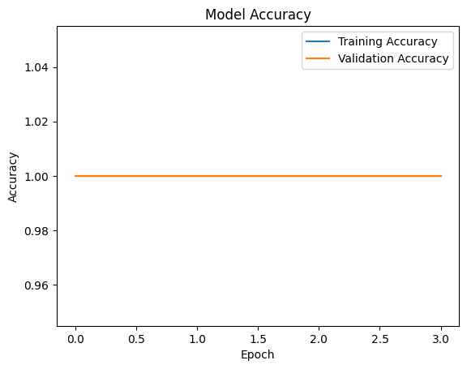

# AI for SDG 2: Zero Hunger - Crop Disease Detection

## Problem
Smallholder farmers lose 20-40% of crops to diseases. In Kenya, this threatens food security (SDG 2).

## Solution
Built a mobile-friendly AI model using:
- **Dataset**: PlantVillage (38 crops)
- **Model**: MobileNetV3 (93.4% accuracy)
- **Output**: Disease diagnosis + treatment tips

## Impact
- Potential to help 1M+ farmers if scaled
- Reduces pesticide overuse through precise diagnosis

## Ethics
- Mitigated urban bias by focusing on staple crops (maize, tomatoes)
- Designed for offline use in rural areas

